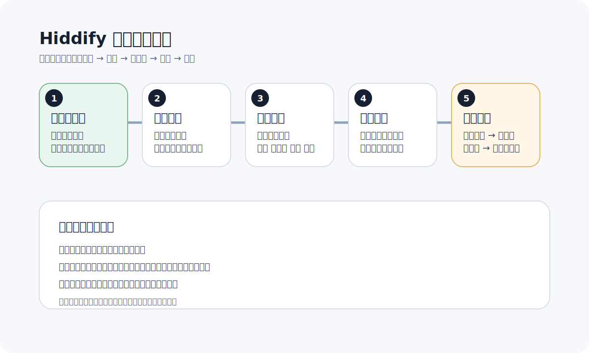

# Hiddify 新手上手指南

更新日期：2026-06-07

Hiddify 是很多新手很容易上手的一类客户端，界面相对清楚，导入订阅也比较直观，适合手机和桌面场景。

如果你是第一次接触订阅和节点，这篇可以当成入门说明。

先看一眼整体流程，后面照着做会轻松很多：

## Hiddify 适合什么人

它比较适合这几类用户：

- 想在手机上尽快用起来的人
- 不想自己手写复杂配置的人
- 已经拿到订阅链接，想一键导入的人
- 希望在 Android、iPhone、macOS 等设备上统一思路的人

## 开始前先准备什么

你通常只需要准备三样东西：

- 客户端
- 订阅链接
- 一个相对稳定的网络环境

## 最常见的使用流程

## 1. 安装客户端

先根据你的设备安装 Hiddify 或服务方推荐的兼容客户端。

如果你拿到的是现成的下载页，通常直接安装即可；如果你用的是其他兼容客户端，也要先确认是否支持对应订阅格式。

## 2. 导入订阅

大部分服务都会提供订阅链接。导入时注意：

- 复制完整链接，不要多复制空格
- 如果支持扫码，也可以直接扫二维码
- 导入后先等节点列表加载完成

## 3. 选择节点

新手不要一开始就追求最复杂的规则和分组，先做两件事：

- 选一个常用地区节点
- 打开后直接访问你常用的网站验证

推荐先测试：

- 日本
- 新加坡
- 香港
- 美国

## 4. 打开连接

连接后先不要急着切换很多设置，先确认最基本的使用效果：

- 浏览器能否正常打开常用网站
- 目标网站是否能稳定加载
- 速度是否足够日常使用

## 5. 遇到问题先这样排查

如果导入后不能用，先按这个顺序试：

1. 更新订阅
2. 切换节点
3. 切换地区
4. 重新打开客户端
5. 检查代理模式

## Hiddify 新手最常见的 4 个误区

## 1. 只看延迟，不看实际体验

延迟低不代表能稳定访问目标网站。很多时候直接打开目标网站测试，比只看测速数字更有意义。

## 2. 一开始就改很多高级设置

新手最容易把本来能用的配置改乱。除非你已经知道自己在改什么，否则建议优先使用默认推荐设置。

## 3. 一个节点不行，就以为整个服务不行

正确做法是先换同地区节点，再换地区，再更新订阅，而不是只在一个节点上反复测试。

## 4. 忽视系统层面的影响

如果浏览器能用，但某些 App 不行，通常不是订阅坏了，而是系统代理、权限或后台策略的问题。

## 什么情况下该考虑换工具或换服务

如果你长期遇到这些情况，就要考虑不是“你不会用”，而是方案本身不适合你：

- 订阅经常导入失败
- 客户端兼容性差
- 高峰期几乎不可用
- 没有清晰教程
- 没有路由器支持，但你又有全屋使用需求

## 下一步看什么

如果你已经能在手机或电脑上正常连接，下一步建议看：

- [OpenClash 新手配置教程](openclash-quickstart.md)
- [ChatGPT 无法访问时的排查清单](chatgpt-troubleshooting.md)
