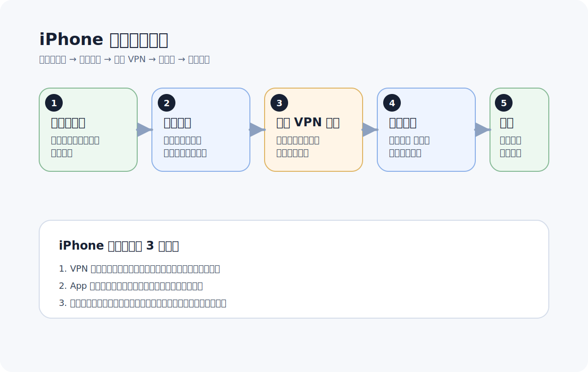

# iPhone 科学上网新手教程

更新日期：2026-06-07

很多人第一次在 iPhone 上使用这类工具时，会觉得“安装很简单，但为什么连上后还是不稳定”。实际上，iPhone 场景里最常见的问题通常不是订阅本身，而是 VPN 授权、后台状态和网络切换没有处理好。

如果你是第一次在 iPhone 上配置，这篇就按最省事的顺序带你走一遍。

先看这张图，能更快理解整体过程：

## iPhone 场景适合什么样的用户

- 主要用手机访问网站和 App 的人
- 希望尽量少折腾配置的人
- 已经拿到订阅链接，只想尽快导入使用的人
- 想先跑通手机，再决定要不要上路由器的人

## 开始前先准备什么

你通常只需要准备这三样：

- 一台 iPhone
- 一个兼容的客户端
- 一条可导入的订阅链接

## 第一步：安装客户端

优先使用服务方推荐的兼容客户端。这样做的好处是：

- 订阅格式更容易兼容
- 教程更容易对得上
- 遇到问题时排查成本更低

如果你手上已经有现成的下载说明，就先按那个版本来，不要一开始就同时装多个客户端。

## 第二步：导入订阅

常见的导入方式一般有两种：

- 复制订阅链接导入
- 扫码导入

导入时注意这几点：

- 链接要复制完整，不要带多余空格
- 导入后先等节点列表刷新完成
- 如果第一次导入失败，先重新复制，不要急着怀疑整条订阅不可用

## 第三步：首次连接时允许 VPN 授权

这是 iPhone 新手最容易忽略的一步。第一次开启连接时，系统会弹出 VPN 权限确认。

这里要做的是：

- 点击允许
- 按系统提示完成验证

如果你误点了取消，客户端可能看起来已经打开，但实际没有真正接管网络流量。

## 第四步：先选一个常用地区节点

新手不需要一上来就在一堆节点里反复切换。更好的方式是先找最常用、最稳定的地区做验证。

建议先试：

- 日本
- 新加坡
- 香港
- 美国

如果主要是日常浏览、社交或 AI 工具，通常先从这些地区开始就够了。

## 第五步：连接后直接打开目标网站测试

不要只看客户端显示“已连接”，要直接验证你的真实使用场景。

可以直接测试：

- ChatGPT
- YouTube
- Telegram
- 你平时最常用的目标网站

这样能更快知道问题是“根本没通”，还是“已经通了但线路不够稳”。

## iPhone 上最常见的 4 个问题

## 1. VPN 授权没通过

表现通常是：

- 客户端状态看起来正常
- 但网页和 App 没有真正走代理

这时先回头确认系统里的 VPN 权限是否已经允许。

## 2. 切换 Wi-Fi 和蜂窝网络后状态异常

iPhone 在网络切换后，有时会出现连接状态没完全恢复的情况。

遇到这种情况，优先这样做：

1. 关闭客户端连接
2. 重新打开连接
3. 再测试目标网站

## 3. 后台状态中断

有时候并不是节点坏了，而是 App 在后台状态发生了变化，导致表面连接还在，实际体验已经异常。

如果你发现刚开始能用，过一会儿不稳定，可以先：

- 完整退出客户端
- 重新打开
- 再切换一次节点测试

## 4. 节点切了，但没有验证真实场景

很多人只看连接图标，没直接打开目标网站，就误以为已经配置好了。

更稳的做法是：

- 每次切节点后都直接测目标网站
- 不要只看延迟

## 一套最快的排查顺序

如果遇到问题，先按这个顺序排：

1. 更新订阅
2. 切换节点
3. 切换地区
4. 关闭后重开客户端
5. 检查 VPN 权限
6. 再次测试目标网站

## 什么情况下该考虑换服务

如果你经常遇到这些问题，就不一定是你不会用，更可能是服务本身不稳定：

- 同一类问题反复出现
- 晚高峰经常掉速
- 节点可用性波动很大
- 文档和教程跟不上客户端变化

## 下一步看什么

如果你已经把 iPhone 跑通了，下一步建议看：

- [Windows 客户端新手教程](windows-quickstart.md)
- [Hiddify 新手上手指南](hiddify-quickstart.md)
- [ChatGPT 无法访问时的排查清单](chatgpt-troubleshooting.md)
