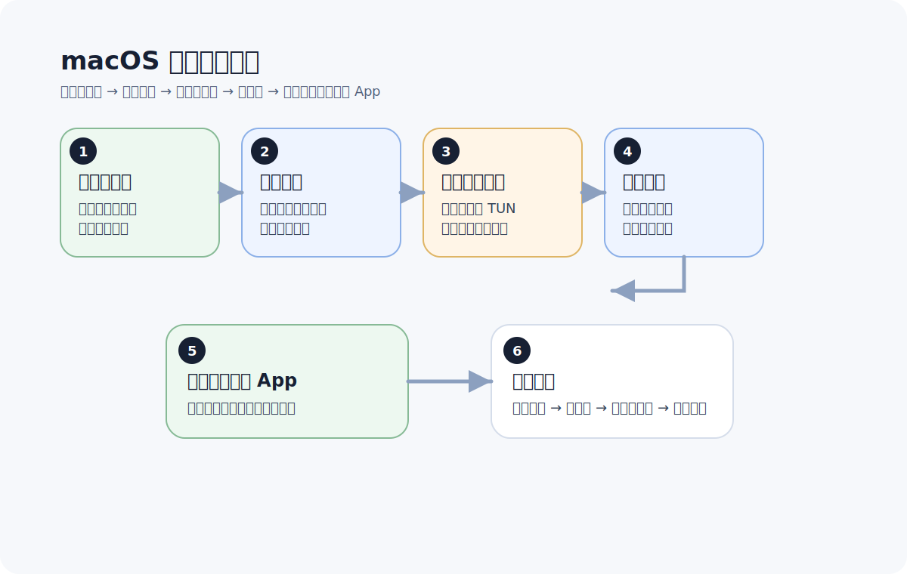

# macOS 科学上网新手教程

更新日期：2026-06-07

macOS 对新手来说通常比 Windows 稳一些，但也有自己常见的坑，比如系统代理没有完全生效、浏览器能用但桌面 App 不通，或者切换节点后以为已经好了，其实只是状态栏看起来正常。

所以这篇会重点帮你确认：mac 上到底有没有真的跑通。

先看整体流程：

## macOS 场景适合什么样的用户

- 平时主要在 Mac 上办公、浏览和用桌面 App 的人
- 想先把电脑跑通，再扩展到手机或路由器的人
- 已经拿到订阅链接，希望尽快导入使用的人
- 不想一开始就去折腾太多高级配置的人

## 开始前先准备什么

通常需要：

- 一台 macOS 设备
- 一个兼容的客户端
- 一条可导入的订阅链接

## 第一步：安装客户端

优先使用服务方推荐的兼容版本。这样做的好处是：

- 订阅格式更容易对上
- 文档更容易跟得上
- 遇到问题时更容易排查

如果你手上已经有现成的下载页，就先按这个版本来，不要一开始就装多个类似客户端。

## 第二步：导入订阅

导入后先确认几件事：

- 节点列表已经正常出现
- 没有明显报错
- 可以看到常见地区或代理组

如果这里就不正常，先检查订阅链接本身，不要马上去改系统网络配置。

## 第三步：开启系统代理或 TUN 模式

macOS 上很常见的一类问题是“浏览器能开，但某些 App 不能用”，或者“客户端明明开着，实际没有完整接管流量”。

新手建议优先：

- 先用默认推荐的代理模式
- 需要桌面 App 也一起走时，再看 TUN 或增强模式

如果你还在最初阶段，不建议一开始就把多个模式混着改。

## 第四步：先选常用地区节点

和其他平台一样，新手不需要先在很多节点里来回折腾。

建议优先测试：

- 日本
- 新加坡
- 香港
- 美国

先把你最常用的场景跑通，比研究一堆测速数字更重要。

## 第五步：直接测试浏览器和桌面 App

macOS 上“网页能打开，App 不稳定”或者“状态看着正常，但体验不对”的情况并不少见。

所以建议直接交叉验证：

- 浏览器打开目标网站
- 如果你常用桌面 App，也一起顺手测试
- 每切一次节点，就重新测试真实场景

## macOS 上最常见的 5 个问题

## 1. 客户端开着，但网页还是打不开

优先怀疑：

- 当前节点不可用
- 订阅没有更新
- 代理模式没有真正生效

## 2. 浏览器能用，但桌面 App 不行

这通常说明：

- 只有部分流量走了代理
- 当前模式没有覆盖到你要用的 App

这时优先回头看代理模式，而不是先怀疑网站本身。

## 3. 切节点后感觉没变化

有时候不是节点没切成功，而是你没有重新验证真实使用场景。

建议：

- 每次切节点后直接测试目标网站
- 不要只看状态栏或延迟数字

## 4. 换网络后状态不稳定

从 Wi-Fi 切到热点、或者从一个网络换到另一个网络后，状态可能暂时不一致。

先做这几步：

1. 关闭连接
2. 重新打开客户端
3. 再测目标网站

## 5. 国内网站也变慢了

这通常说明分流或代理模式不太合适，可能把本不需要走代理的流量也带过去了。

优先建议：

- 用规则模式
- 用默认推荐设置
- 先不要手动改太多高级项

## 一套最快排查顺序

如果 macOS 上出现问题，先按这个顺序排：

1. 更新订阅
2. 切换节点
3. 切换地区
4. 检查代理模式
5. 重开客户端
6. 再测浏览器和桌面 App

## 什么情况下该考虑换服务

如果你反复做同样排查还是不稳定，问题很可能不在你本地，而在服务本身：

- 高峰期经常掉速
- 节点质量波动大
- 同一地区长期不稳
- 文档和教程长期不更新

## 下一步看什么

如果你已经把 Mac 跑通了，下一步建议看：

- [iPhone 科学上网新手教程](iphone-quickstart.md)
- [Windows 客户端新手教程](windows-quickstart.md)
- [OpenClash 新手配置教程](openclash-quickstart.md)

## 遇到这些问题时看这里

- 状态栏看起来正常，但网页还是打不开：看 [翻墙老是掉线怎么办](../recommendations/why-does-vpn-keep-disconnecting.md)
- 浏览器能用，但桌面 App 不行：看 [电脑翻墙推荐：桌面用户怎么选更不容易踩坑](../recommendations/computer-cross-border-recommendations.md)
- 你用的是 Mac，想先看设备入口：看 [Mac 翻墙推荐：macOS 用户第一次怎么选更省时间](../recommendations/macos-cross-border-recommendations.md)
- ChatGPT 登录或长对话一直转圈：看 [ChatGPT 转圈怎么办](../recommendations/chatgpt-loading-forever-fix.md)
