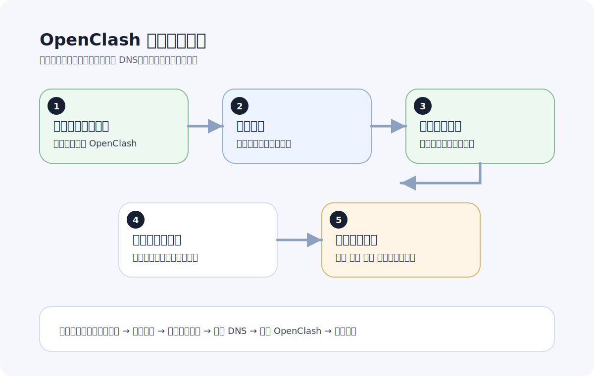

# OpenClash 新手配置教程

更新日期：2026-06-07

如果你想让手机、电脑、电视、游戏机这些连上同一个 Wi-Fi 的设备都能一起使用，OpenClash 这类路由器方案通常比每台设备单独装客户端更省心。

这篇先不讲复杂原理，只讲新手最需要知道的使用顺序。

如果你是第一次接触路由器方案，先看这张流程图会更容易建立整体概念：

## OpenClash 适合谁

- 家里设备多，不想每台单独配置的人
- 想让电视、游戏机、平板一起走代理的人
- 已经有 OpenWrt 路由器或旁路由的人
- 希望国内外流量自动分流的人

## 开始前要准备什么

通常需要这些条件：

- 已经能进入路由器管理界面
- 路由器支持 OpenClash 或同类方案
- 你有可导入的订阅链接

## 新手最推荐的配置思路

一句话就是：先让它跑起来，再慢慢优化。

很多人一开始就去改 DNS、规则集、代理组、内核参数，最后把最基础的连接也搞乱了。对新手来说，最重要的是先走通最小闭环。

## 第一步：导入订阅

先把订阅导入 OpenClash，确认配置文件能正常拉取。

导入后先看三件事：

- 配置是否能成功下载
- 节点列表是否正常显示
- 代理组是否自动生成

## 第二步：先用默认规则

新手不建议上来就自定义复杂规则。先使用默认推荐规则，确认这些场景正常：

- 国内网站直连
- 国外网站能打开
- 常用 App 能联网

只要这三项成立，就已经说明整体方向没问题。

## 第三步：选一个稳定的默认代理组

很多人明明导入成功了，但默认组选错，实际体验还是会很差。

建议优先：

- 选自动选择
- 或选你测试下来最稳定的常用地区

不要一开始就频繁手动切换十几个组，容易越调越乱。

## 第四步：验证全屋设备是否都正常

OpenClash 的价值不只是让你路由器显示“已连接”，而是让全屋设备都能真实可用。

建议至少测试：

- 手机
- 电脑
- 智能电视
- 游戏机或平板

## 新手最常见的问题

## 1. 路由器显示正常，但设备打不开国外网站

优先怀疑：

- 规则模式不对
- 默认代理组选择不对
- DNS 配置冲突

## 2. 国内网站也变慢了

这通常说明分流没有做好，或者所有流量都绕到了代理。

正确方向是：

- 确认启用规则模式
- 优先使用成熟的分流规则
- 不要手动把国内流量也强制走代理

## 3. 电视和游戏机表现和手机不一样

这类设备通常更依赖路由器层面的配置，所以一旦分流、DNS 或默认组不对，问题会更明显。

可以先让手机和电脑验证通过，再测电视和游戏机。

## 一套最实用的排查顺序

1. 更新订阅
2. 切换默认代理组
3. 检查规则模式
4. 检查 DNS
5. 重启 OpenClash
6. 重启终端设备

## 什么时候说明你已经配好了

如果下面几件事都成立，说明 OpenClash 已经完成了新手阶段最重要的配置：

- 手机和电脑都能正常访问目标网站
- 国内 App 不受明显影响
- 电视和其他家庭设备也能一起使用
- 不需要每次换设备都重新折腾

## 下一步怎么优化

先把稳定性跑顺，再逐步做这些优化：

- 找出最适合你的默认地区
- 根据自己的场景调整代理组
- 再考虑更细的规则和 DNS 优化

如果你当前还在“能不能用”这个阶段，就先别急着碰太多高级项。
