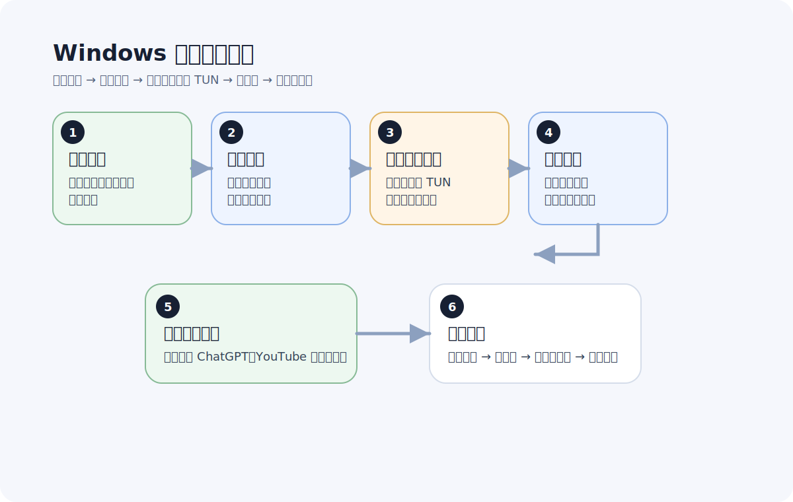

# Windows 客户端新手教程

更新日期：2026-06-07

Windows 是很多人最常用的桌面环境，但也是最容易因为代理模式、软件权限、系统网络状态而出现“看起来连上了，实际上部分软件不能用”的平台。

所以这篇会更强调“怎么确认它真的可用”，而不是只看连接状态。

先看整体流程：

## Windows 场景适合什么样的用户

- 主要在电脑上用浏览器和桌面 App 的人
- 想访问 ChatGPT、YouTube、Telegram 等目标服务的人
- 已经拿到订阅链接，想尽快导入使用的人
- 想先把电脑跑通，再考虑手机或路由器的人

## 开始前先准备什么

通常需要：

- 一台 Windows 电脑
- 服务方推荐的兼容客户端
- 一条可导入的订阅链接

## 第一步：下载安装客户端

优先用官方或服务方推荐版本，原因很简单：

- 兼容性更稳定
- 文档更容易对得上
- 遇到问题时更容易判断是软件问题还是线路问题

安装完成后，不用急着改高级设置，先把最基本的流程跑通。

## 第二步：导入订阅

常见方式一般是复制订阅链接，然后在客户端里导入。

导入后先确认三件事：

- 节点列表已经正常显示
- 没有明显报错
- 可以看到不同地区的节点或代理组

如果这里就失败，优先先检查链接本身，而不是立刻改系统网络设置。

## 第三步：打开系统代理或 TUN 模式

Windows 场景里，一个很常见的问题是“客户端开着，但流量根本没走过去”。这通常和代理模式有关。

常见思路是：

- 浏览器为主：先看系统代理模式
- 桌面 App 也要走：再考虑 TUN 或增强模式

如果你还在新手阶段，优先用服务方推荐的默认模式，不要一开始就混着开很多网络选项。

## 第四步：先选常用地区节点

建议不要一上来就在几十个节点里来回跳。

先测试最常用的几个地区：

- 日本
- 新加坡
- 香港
- 美国

如果你的主要场景是 AI 工具、视频或社交，先把最常用场景跑通就够了。

## 第五步：直接测试目标网站和桌面 App

这一步非常重要。Windows 上“浏览器能用、桌面软件不能用”或者“网页能打开、登录异常”的情况很常见。

建议交叉测试：

- 浏览器打开目标网站
- 如果你有桌面 App，也顺手一起测试
- 测完再决定是不是要换节点

## Windows 上最常见的 5 个问题

## 1. 客户端显示已连接，但浏览器打不开网页

优先怀疑：

- 系统代理没生效
- 当前节点不可用
- 订阅已经过期或失效

## 2. 浏览器能用，但桌面 App 不行

这类情况通常说明：

- 某些流量没有真正走代理
- 当前模式只覆盖了部分软件

这时就要回头看代理模式是不是设置对了。

## 3. 切了很多节点还是不稳定

这通常不是“你没找到那个神奇节点”，而是应该先换地区、更新订阅，再看是不是服务整体质量有问题。

## 4. 一开软件就影响国内网站速度

这往往说明分流不合理，或者所有流量都绕代理了。

新手建议优先：

- 使用规则模式
- 使用默认推荐设置
- 不要手动强制所有网站都走代理

## 5. 重启电脑后又不正常了

这类问题多半和客户端启动顺序、系统代理状态、权限或软件自身状态有关。

先别急着重装，优先这样做：

1. 重新打开客户端
2. 更新订阅
3. 切换节点
4. 再测目标网站

## 一套最快排查顺序

如果 Windows 上出现问题，先按这个顺序排：

1. 更新订阅
2. 切换节点
3. 切换地区
4. 检查系统代理或 TUN 模式
5. 重开客户端
6. 再测试目标网站和桌面 App

## 什么情况下该考虑换服务

如果你经常遇到这些问题，说明可能不是本地设置，而是服务本身不给力：

- 高峰期掉速严重
- 节点稳定性差
- 同样的排查反复做还是不稳
- 文档和更新跟不上客户端变化

## 下一步看什么

如果你已经把 Windows 跑通了，下一步建议看：

- [iPhone 科学上网新手教程](iphone-quickstart.md)
- [OpenClash 新手配置教程](openclash-quickstart.md)
- [ChatGPT 无法访问时的排查清单](chatgpt-troubleshooting.md)

## 遇到这些问题时看这里

- 客户端显示已连接，但网页还是打不开：看 [翻墙老是掉线怎么办](../recommendations/why-does-vpn-keep-disconnecting.md)
- 浏览器能用，但桌面 App 不行：看 [电脑翻墙推荐：桌面用户怎么选更不容易踩坑](../recommendations/computer-cross-border-recommendations.md)
- Roxi 在电脑上连接后还是打不开：看 [Roxi 连上了但打不开怎么办](../recommendations/roxi-connected-but-not-working.md)
- ChatGPT 登录后一直转圈：看 [ChatGPT 转圈怎么办](../recommendations/chatgpt-loading-forever-fix.md)
